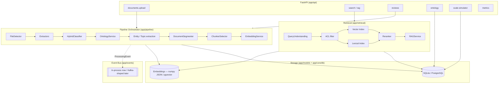
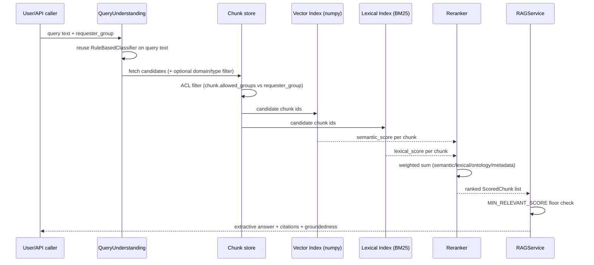

# KCIP Architecture

This document is the system-level map. Each subsystem gets a deeper, dedicated treatment elsewhere in `docs/` — this page exists to show how they fit together and to give the one-paragraph "why" for each layer before you go read the details.

## Layered view

Everything in `PIPE` and `RET` is built against interfaces (`BaseExtractor`, `BaseDocumentClassifier`, `BaseChunker`, `VectorIndexBackend`, `EmbeddingProvider`, `BaseLLMProvider`) with a POC-default implementation behind each one. Swapping a production implementation in means changing a factory function (`app/*/factory.py`) or a `Settings` value — never the callers. This pattern is deliberate and repeated everywhere; see [decisions.md](decisions.md) for why.

## Ingestion architecture

A document enters through `POST /api/documents/upload` (or the batch seed script) and is handed to `PipelineOrchestrator.ingest_document()`, which:

1. Hashes the raw bytes (SHA-256) and checks for an existing document with the same checksum — a duplicate is recorded and short-circuited before touching any parsing logic (see [ingestion.md](ingestion.md)).
2. Runs the document through a strict state machine — `RECEIVED → VALIDATED → EXTRACTING → EXTRACTED → CLASSIFYING → CLASSIFIED → ONTOLOGY_MAPPED → ENRICHED → SEGMENTED → CHUNKED → EMBEDDING → INDEXED → READY` — persisting a `ProcessingEvent` at every transition.
3. Halts at `REVIEW_REQUIRED` (between `ENRICHED` and `SEGMENTED`) if classification confidence is too low, instead of guessing forward.

Every stage is timed (`duration_ms` on `ProcessingEvent`) and the whole thing runs synchronously in-process for the POC — there is no background worker queue. The orchestration logic is written so that swapping "synchronous in-process call" for "consume a message off a topic, one stage per worker pool" is purely an infrastructure change (see `app/events/bus.py` and [production-scaling.md](production-scaling.md)).

## Content intelligence layer

This is the layer naive RAG pipelines skip entirely, and it's the actual thesis of this POC. It sits between "raw extracted text" and "chunk ready to embed," and it's responsible for answering, per document: *what is this, structurally and semantically, and who should be allowed to see it* — before any embedding call happens.

- **Detection** (`app/services/file_detector.py`) — deterministic, zero-ML, extension + magic-byte sniffing. Cheap and 100% reproducible, which matters once you're triaging hundreds of thousands of files.
- **Extraction** (`app/extractors/*.py`) — one extractor per format, all conforming to `BaseExtractor`, all producing the same `ExtractedElement` shape (`heading`/`paragraph`/`table`/`sheet`/`slide`/`code_block`/`email_header`/`email_body`/…) so nothing downstream branches on file type again.
- **Classification** (`app/classifiers/*.py`) — hybrid rule + embedding + cost-gated LLM blend onto the controlled ontology. See [classification.md](classification.md).
- **Ontology mapping** (`app/ontology/service.py`) — resolves the classifier's chosen leaf into domain, document type, chunker hint, and security defaults.
- **Enrichment** (`app/services/entity_extractor.py`, `app/services/topic_extractor.py`) — synthetic named-entity extraction (organizations, departments, regulations, people, money, dates) and a small fixed controlled-vocabulary topic tagger. Both are provider-independent interfaces so an LLM/NER backend could replace the rule-based DEMO_MODE implementation without touching any caller.

Only once all of this exists does segmentation and chunking begin.

## Ontology architecture

`ontology/healthcare_ontology.yaml` is the single source of truth for every category a document can be classified into — 5 domains, each with categories and leaf types, each leaf carrying `document_type`, `keywords`, a `chunker` hint, and (inherited from its domain) `default_security_level`/`default_allowed_groups`. `OntologyService` (`app/ontology/service.py`) is the *only* module that reads this file; classifiers, the chunker selector, and security-default resolution all go through it. See [ontology.md](ontology.md) for the full tree and the config-vs-code rationale.

## Classification architecture

Every document gets a deterministic rule-based vote and a local embedding-similarity vote; these are blended with confidence-tiered weighting, and only documents in an uncertain middle band get an (optionally configured) LLM adjudication call — constrained to the already-narrowed candidate set, never free text. See [classification.md](classification.md) for the exact blend math and the honest rules-vs-ML-vs-LLM trade-off discussion.

## Chunking architecture

Chunker selection (`app/chunkers/selector.py`) is two-factor: file **structure** first (a slide deck, worksheet, or email always gets its structure-native chunker regardless of what it's about), then ontology-configured **semantic hint** second, for flowing-text formats that offer no structural hint of their own. Six chunkers implement the actual splitting logic — Contract, Technical, Spreadsheet, Presentation, Email, Generic. See [chunking.md](chunking.md).

## Retrieval architecture

Vector search is a numpy cosine-similarity backend in the POC (`VectorIndexBackend` interface, `NumpyVectorIndexBackend` implementation) — correct and fast enough for dozens-to-hundreds of chunks, with `pgvector` documented as the production swap-in but not exercised (no local Postgres in this dev environment). Lexical search is BM25 (`rank_bm25`) rebuilt per query over the candidate set, with an absolute saturating score transform rather than min-max normalization — see [retrieval.md](retrieval.md) for exactly why that distinction mattered in practice (a real bug, found and fixed). Reranking is an explicit, configurable weighted sum, deliberately labeled a POC heuristic with the interface shaped for a cross-encoder to replace later.

## Scaling architecture

The POC runs single-process, synchronous, SQLite-backed. The designed production shape (not built here, but explicitly planned for) is object storage (S3/ADLS/GCS) feeding a Kafka/Event-Hub-style event bus, with independently-scaling worker pools per pipeline stage, PostgreSQL+pgvector (or a dedicated vector database) for storage, and horizontal partitioning by tenant/domain. `app/services/scale_simulator.py` projects document counts, storage, throughput, and cost-aware-routing distribution at any scale using a blend of this POC's own measured ratios and cited public reference points — never a real loaded 1TB dataset. Full detail in [production-scaling.md](production-scaling.md).

## Security

Every `Document` and `Chunk` row carries `security_level` (`public`/`internal`/`confidential`/`restricted`) and `allowed_groups`, both derived from the ontology domain's configured defaults at classification time (`OntologyService.security_defaults_for()`) — never hand-coded per feature. Retrieval filters candidates against `requester_group` before any scoring happens, so an excluded document never has a chance to leak through a coincidental lexical match. Full model and the ACL demo scenario in [security.md](security.md).

## Observability

Three durable, queryable trails back every claim the system makes about itself:

- **`ProcessingEvent`** — append-only, per-document, per-stage log with `status`, `message`, and `duration_ms`. Powers the ingestion job detail view (`GET /api/ingestion/jobs/{id}`) and is the same event stream published on the `EventBus`.
- **`ClassificationResult`** history — every classification attempt (not just the current one) is preserved with `is_current` flags, so a later ontology/classifier version bump never silently overwrites what a historical decision actually was.
- **`RetrievalLog`** (schema defined, wired for future use) — captures a query's understanding, filters, and full scored result set for later analysis.

`GET /api/metrics` aggregates processing success rate, confidence distribution, cost-aware-routing split (rule/embedding vs. LLM-adjudicated vs. human-corrected), and per-domain/type/file-extension counts directly from these tables — all read-only aggregation, no separate metrics pipeline to keep in sync. `GET /api/health` reports the active mode (`demo_mode`, `effective_llm_mode`, `embedding_provider`, `vector_backend`, `database`) so it's always visible which configuration produced a given result. See [production-scaling.md](production-scaling.md) for what a production observability stack (structured logging, distributed tracing, metrics export) would add on top.

## Where to go next

- Building/reading a specific stage in depth: [ingestion.md](ingestion.md), [classification.md](classification.md), [chunking.md](chunking.md), [retrieval.md](retrieval.md), [security.md](security.md)
- The ontology itself: [ontology.md](ontology.md)
- Why each major choice was made, and what the alternatives were: [decisions.md](decisions.md)
- What's real vs. simulated, and what's not production-ready yet: [evaluation.md](evaluation.md), [production-scaling.md](production-scaling.md)
