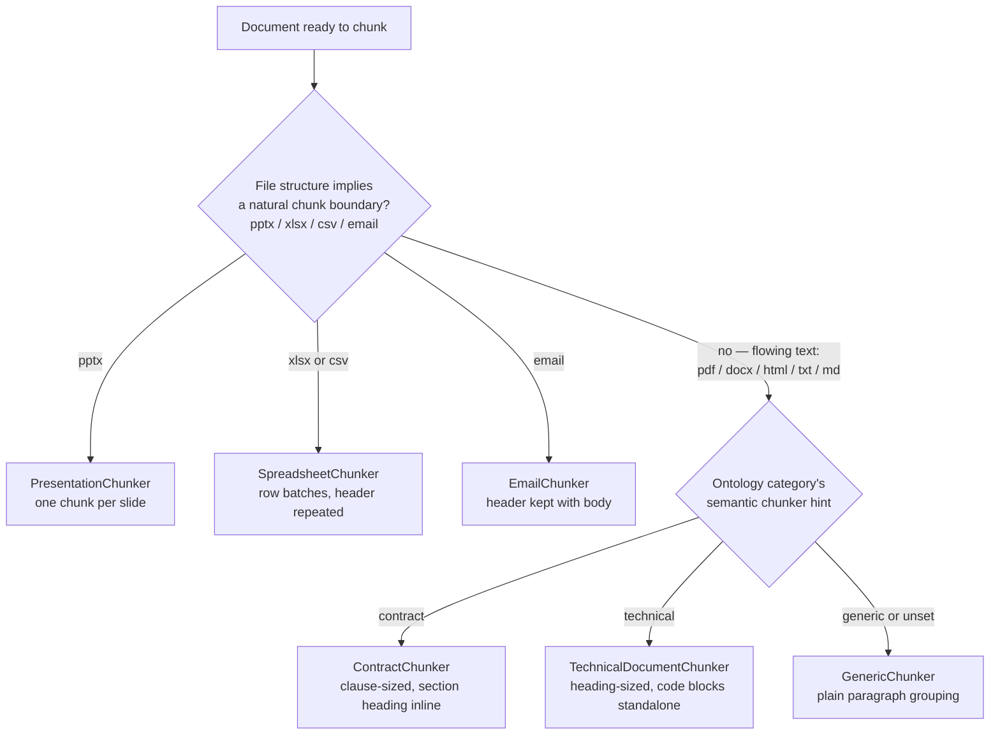

# Chunking Architecture

## The decision: format first, semantics second

Chunker selection (`app/chunkers/selector.py`) is what makes "type-aware chunking" real rather than cosmetic. It's a two-factor decision, and the order of those two factors is the entire design:



**Factor 1, file structure, always wins when it applies.** A `.pptx` is always chunked by slide, a `.xlsx`/`.csv` is always chunked by row batch, an email is always chunked with its header kept attached to its body — regardless of what the document is *about*. A slide deck about legal contracts is still chunked by slide, because that's how the content is actually organized; semantics cannot override a format that already tells you where the natural boundaries are. This is `FORMAT_FORCED_CHUNKER` in `selector.py` — checked first, unconditionally.

**Factor 2, the ontology's semantic `chunker` hint, only applies when format gives no hint of its own.** PDF, DOCX, HTML, TXT, and MD are all "just flowing text" as far as the file format is concerned — a contract-shaped PDF and a runbook-shaped PDF are both, mechanically, "a PDF with paragraphs and headings." But they need different chunking: a contract's clauses often only make sense read together (a termination clause referencing defined terms elsewhere), while a runbook's steps are self-contained and should stay small and precise. The ontology leaf's `chunker` field (set per-category in `ontology/healthcare_ontology.yaml`) supplies that distinction, resolved via `OntologyService.chunker_for(ontology_id)`.

Why not one factor alone? Pure format-based chunking (factor 1 only) would chunk every contract PDF, runbook PDF, and invoice PDF identically, throwing away exactly the semantic distinction that makes type-aware chunking worth having. Pure semantic-based chunking (factor 2 only, ignoring structure) would try to apply prose-oriented logic to a spreadsheet or a slide deck, where "paragraph" isn't even a meaningful unit — you'd either lose the header-to-row association in a table, or lose the title-to-bullets association in a slide. Two factors, applied in this priority order, is what covers both cases correctly. This is ADR-003 in [decisions.md](decisions.md).

## The shared rule: never split a paragraph mid-sentence

Every text-based chunker (Contract, Technical, Generic, and Email's body) accumulates paragraphs into groups up to a `MAX_CHARS` budget using `greedy_group()` (`app/chunkers/base.py`) — it never splits a single paragraph across two chunks, only decides where between paragraphs a chunk boundary falls. `MAX_CHARS` differs per chunker specifically because different content has different "this needs to stay together" requirements — see each chunker below.

## ContractChunker — clause-sized, section heading inline

`MAX_CHARS = 1500` — larger than the generic default, because contract clauses often only make sense read together (a termination clause referencing a defined term from the Definitions section). Every chunk is prefixed with its parent section's title, so a chunk retrieved standalone by search is still self-explanatory without needing the whole document alongside it.

**Concrete example**, `provider_agreement_northvalley.pdf` (`legal.contracts.provider_agreement`, `chunker: contract`): "Section 4: Termination" reads *"Either party may terminate this Agreement upon ninety (90) days written notice... Provider termination requires written notice delivered to the Provider Network Management department."* `ContractChunker` produces a chunk whose text begins `Section 4: Termination\n\n<paragraph text>` — which is exactly the chunk the RAG evaluation cites (Precision@1 = 100%) when asked *"What are the provider termination requirements?"*: the answer is grounded in this single, section-labeled chunk, not a mid-clause fragment.

## TechnicalDocumentChunker — heading-sized, code blocks standalone

`MAX_CHARS = 1000`. Chunks by heading/subsection like a generic chunker would, but with one extra rule: a Markdown fenced code block (`ExtractedElement.type == "code_block"`) is always flushed out as its own standalone chunk, never folded into the surrounding prose paragraphs before or after it. Splitting a code sample across two chunks — or burying it in the middle of a prose chunk — makes both the code and the explanation around it harder to retrieve usefully.

**Concrete example**, `api_architecture_document.md` (`technical.architecture.api_architecture_document`, `chunker: technical`): the "API Design" section contains a fenced code block —

```
GET /api/v1/patients/{patient_id}/appointments
POST /api/v1/appointments
```

`TextExtractor._extract_markdown` tags this as a `code_block` element; `TechnicalDocumentChunker` flushes any buffered prose first, emits the code block as its own chunk (verbatim, no section-title prefix, no reformatting), then continues buffering the prose that follows. A search for "appointments endpoint" retrieves that exact snippet as a complete, uncluttered unit.

## SpreadsheetChunker — logical row batches, not character count

`ROWS_PER_CHUNK = 25`. Ignores character count entirely and instead batches rows, repeating the header row at the top of every batch. A chunk of claim rows without its header is just numbers — a viewer (human or retrieval system) has no way to know which column is `Billed Amount` versus `Paid Amount` without it.

**Concrete example**, `insurance_claim_report_q3.xlsx` (`financial.claims.insurance_claim_report`, format-forced `spreadsheet` chunker — the ontology's own hint for this category also happens to be `spreadsheet`, so there's no conflict here, but the point is the *format* forces it regardless): the sheet has headers `Claim ID | Provider | Payer | CPT Code | Billed Amount | Paid Amount | Status | Date` and 5 data rows, all fitting in a single 25-row batch. The resulting chunk text starts with `Sheet: Claims (rows 1-5)` followed by the header line, then each row rendered as `CLM-100234 | North Valley Hospital | Meridian Health Partners | 99213 | 185.0 | 148.0 | Paid | 2026-07-03`. A larger sheet would produce multiple chunks, each independently carrying the same header line. `claims_export_q3.csv` goes through the identical chunker (format-forced for `.csv` too) even though it's a completely different file format — structure, not extension, is what SpreadsheetChunker actually cares about (it looks for a `sheet` or `table` extracted element either way).

## PresentationChunker — one chunk per slide

No character budget at all — a slide is the natural retrieval unit for a deck, whatever its size. Title and body text are kept together in one chunk, because a bullet list is meaningless without the slide title framing it (e.g. "Phase 1: Extract Identity Service" means nothing without knowing it's a bullet under "Migration Roadmap").

**Concrete example**, `technical_architecture_presentation.pptx` (`technical.architecture.technical_architecture_presentation`, format-forced `presentation` chunker): the "Migration Roadmap" slide becomes one chunk with text `Migration Roadmap\n\nPhase 1: Extract Identity Service\nPhase 2: Extract Scheduling Service\nPhase 3: Decommission legacy monolith` — title and all three bullets together, exactly as they'd need to be read to make sense.

## EmailChunker — header context stays attached to the body

`MAX_CHARS = 1200`. Prepends the rendered header block (`From`/`To`/`Subject`/`Date`) as the first "paragraph" fed into the same greedy grouping used by text chunkers, so header context survives into whichever chunk(s) the body is split across. A body-only chunk loses who sent it and when — for an outreach or compliance-relevant email, that's often the fact that matters most.

**Concrete example**, `provider_outreach_email.eml` (`administrative.communications.provider_outreach_email`, format-forced `email` chunker): the message is short enough to fit in one chunk, which begins `From: Provider Network Management <network@meridianhealthpartners.example>\nTo: providers@northvalleyhospital.example\nSubject: Network Update: New Credentialing Portal\nDate: Mon, 17 Aug 2026 09:00:00 -0500` followed by the full body about the new credentialing portal and the 60-day re-attestation deadline — so a retrieval hit on "credentialing portal" still tells you who sent it and when, not just what it said.

## GenericChunker — the fallback for everything else

`MAX_CHARS = 800` — the smallest budget of any chunker, appropriate for content with no larger structural unit worth preserving (an invoice, a form, an ad hoc memo). Plain paragraph grouping, no section-title prefixing, no structural assumptions beyond "don't split a paragraph."

**Concrete example**, `hospital_invoice_2456.pdf` (`financial.invoices.hospital_invoice`, `chunker: generic`): the "Payment Terms" paragraph and the itemized services table both become their own chunk-sized groups without any larger clause or heading structure imposed on them — appropriate, because an invoice doesn't have contract-style clauses or technical-doc-style subsections to preserve. `ambiguous_mixed_memo.pdf` — the intentionally low-confidence document — also runs through `GenericChunker` once a human resolves its review task, for the same reason: an account memo has no stronger structure to exploit.

## Where chunk metadata comes from

Regardless of which chunker produced it, every `Chunk` row is enriched identically by the orchestrator after chunking (`PipelineOrchestrator._stage_chunk`): the parent document's `document_type`/`domain`/`ontology_id`/`ontology_path`/`classification_confidence`/`security_level`/`allowed_groups` are denormalized directly onto the chunk (so retrieval and ACL filtering never need a join to reconstruct that context), plus per-chunk `topics` (via the fixed controlled-vocabulary tagger, [architecture.md](architecture.md)) and `entities` (whichever document-level extracted entities' text actually appears in that specific chunk). This is what lets a single chunk be independently interpretable, filterable, and access-controlled without ever looking back at its parent document row.
