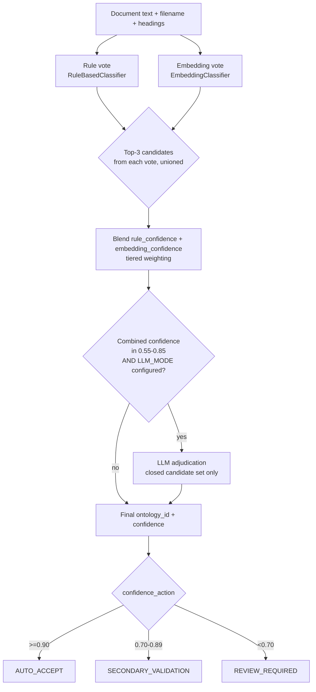

# Classification Architecture

## Rules vs. ML vs. LLM: there is no universally correct answer

Three fundamentally different classification strategies are available, and each has a real weakness the others don't share:

- **Rule-based** (keyword/filename/heading scoring) is deterministic, instant, free, and fully explainable — you can point at exactly which words in exactly which part of the document produced the score. Its weakness: it only catches what it's told to look for. A document that describes termination terms without ever using the word "termination" gets no credit.
- **Embedding-based** (cosine similarity against ontology-leaf prototypes) catches paraphrase and topical similarity that keyword matching misses. Its weakness, at least with the dependency-free default embedding provider used here: it's a much blunter instrument for a short, keyword-dense prototype compared to a long, narrative document, and it can't explain *why* two things are similar the way a keyword match can point at literal text.
- **LLM adjudication** is the most flexible — it can weigh nuanced, conflicting, or sparse signals the way a human reviewer would. Its weaknesses are exactly the ones that matter in production: it costs money and latency per call, it's non-deterministic unless pinned carefully, and left unconstrained it can "classify" a document into a category that doesn't exist in your controlled ontology at all.

None of these three is correct on its own for every document, every confidence level, and every cost budget — which is why `HybridClassifier` (`app/classifiers/hybrid.py`) blends the first two always, and calls in the third only when it's actually needed and actually configured. This is the point of ADR-002 in [decisions.md](decisions.md): the answer here is a deliberate, POC-scoped default, not a universal claim that hybrid-with-LLM-adjudication is always the right architecture.

## The four-stage pipeline



**Stage 1 — Rule vote** (`RuleBasedClassifier`). Scores every controlled ontology leaf by keyword overlap against the filename, extracted headings, and body text, with filename matches weighted highest (`+3.0`), then heading matches (`+2.5`), then body matches (`+1.0` per hit, capped at 3 hits). A document titled "Provider Agreement" is much more likely to *be* one than a document that merely mentions the phrase once in passing — the weighting encodes that directly. Naive singular/plural tolerance (`_keyword_variants`) gives a small amount of lexical robustness without a real stemmer. Raw score is converted to a confidence via a saturating curve:

```
confidence = 1 - e^(-raw_score / SATURATION_K)      SATURATION_K = 3.5
```

`SATURATION_K` is hand-calibrated against the golden set so that a strong filename+heading+body match (roughly 10+ raw points) saturates above 0.95. The code is explicit that this is a placeholder for real calibration: *"A production system would recalibrate this against a much larger labeled sample (e.g. Platt scaling) rather than a hand-picked constant."*

**Stage 2 — Embedding vote** (`EmbeddingClassifier`). Synthesizes a prototype embedding per ontology leaf (`name + keywords + parent category name`) and compares the document's own embedding (filename + headings + first 2000 chars) against every prototype via cosine similarity. This is what catches a paraphrased document the rule vote would miss — in principle. With the default `local_hash` embedding provider (a dependency-free bag-of-hashed-terms vector, not a learned semantic model — see [decisions.md](decisions.md)), it mostly still rewards lexical overlap, just with different mechanics than exact keyword counting; a real sentence-embedding model would make this vote meaningfully more capable of catching true paraphrase.

**Stage 3 — Blend.** Both votes' top-3 scoring candidates are unioned into a candidate set, then each candidate's rule and embedding scores are converted to comparable confidences and blended:

```python
RULE_WEIGHT = 0.7
EMBEDDING_WEIGHT = 0.3
DOMINANT_RULE_THRESHOLD = 0.95
DOMINANT_RULE_WEIGHT = 0.85
DOMINANT_EMBEDDING_WEIGHT = 0.15
EMBEDDING_CALIBRATION = 1.35   # corrects for prototype-vs-document length mismatch

def _blend(rule_conf, emb_conf):
    if rule_conf >= DOMINANT_RULE_THRESHOLD:
        return DOMINANT_RULE_WEIGHT * rule_conf + DOMINANT_EMBEDDING_WEIGHT * emb_conf
    return RULE_WEIGHT * rule_conf + EMBEDDING_WEIGHT * emb_conf
```

Two calibration details matter here, both explained directly in the code:

- **`EMBEDDING_CALIBRATION = 1.35`** exists because the `local_hash` provider compares a short ontology-leaf prototype against a much longer document, which structurally dampens bag-of-hashed-terms cosine similarity even for a genuinely on-topic match. This constant corrects the embedding vote's *scale* so it's comparable to the rule vote's before blending — "a learned embedding model would not need this."
- **The dominant-rule tier** (`>= 0.95` rule confidence gets `0.85/0.15` weighting instead of `0.7/0.3`) encodes a specific belief: when filename, heading, and body all independently corroborate the same leaf, that's stronger evidence than one embedding comparison against a short prototype can meaningfully override. Below that threshold — a contested or weak rule signal — the embedding vote gets its full normal weight, which is exactly the case it's useful for disambiguating.

**Stage 4 — Cost-gated LLM adjudication.** Only invoked when the blended confidence lands in `[0.55, 0.85)` *and* `Settings.effective_llm_mode` is true (an LLM is actually configured with a real API key and provider, not just `LLM_MODE=true` with nothing behind it). This is the cost-aware routing story made concrete: most documents' rule+embedding blend already lands clearly above or below that band, so **most documents never reach stage 4 at all**, and the ones that do are exactly the ones where the cheap signals disagreed enough to be worth paying for a slower, costlier opinion. When it does run, `LLMClassifier.classify_among()` is handed only the already-narrowed candidate id list — never the full ontology, never free text — and any response naming an id outside that list is discarded rather than trusted (see [ontology.md](ontology.md), "Controlled classification enforcement").

## Confidence-based routing

`ConfidenceService.action_for()` (`app/services/confidence.py`) maps the final blended confidence to one of three actions, thresholds configurable via `Settings`, never hard-coded at call sites:

| Confidence | Action | Meaning |
|---|---|---|
| ≥ 0.90 | `AUTO_ACCEPT` | Pipeline continues automatically |
| 0.70 – 0.89 | `SECONDARY_VALIDATION` | Pipeline continues automatically (flagged for spot-check, not blocked) |
| < 0.70 | `REVIEW_REQUIRED` | Pipeline halts until a human resolves it (see [decisions.md](decisions.md) ADR-005) |

## Calibration results on the golden set

Measured by `scripts/evaluate.py` against `data/samples/golden_labels.json` (18 synthetic documents) and written to `data/processed/evaluation_report.json`:

- **94.4% ontology accuracy (17/18)**, **100% domain accuracy**, **22.2% review rate** (4 of 18 documents).
- **Confidence band distribution:** 9 `AUTO_ACCEPT`, 5 `SECONDARY_VALIDATION`, 4 `REVIEW_REQUIRED`.

**The one ontology miss** is `ambiguous_mixed_memo.pdf` — a document *deliberately* authored (see `scripts/seed_demo_data.py: build_ambiguous_document`) with weak, mixed invoice/reimbursement language and no dominant heading signal. It's predicted `financial.invoices.hospital_invoice` at confidence ≈ 0.174, against a golden label of `financial.reimbursement.reimbursement_policy` — but because 0.174 is far below the 0.70 review threshold, the document is correctly routed to `REVIEW_REQUIRED` rather than silently filed under the wrong category. This is the intended human-in-the-loop demonstration, not a classifier defect: the honest outcome for a genuinely ambiguous document is "the system says it isn't sure," and it says exactly that.

**Three of the four `REVIEW_REQUIRED` documents** are the corpus's spreadsheet/CSV-format financial documents (the two `.xlsx` reports and the `.csv` claims export). This is a real, honest finding, not a bug: structured, tabular content is mostly numbers, codes, and column headers, which carries much less of the narrative prose that keyword and embedding text-matching are built to score against. A table full of CPT codes and dollar amounts simply doesn't "say" `reimbursement rate` or `claim adjudication` in flowing sentences the way a policy document does, even when the *category* is obvious to a human glancing at the column headers. See [evaluation.md](evaluation.md) for the full breakdown and the named production fix (a schema/column-header-aware classification signal, so a table's structure — not just its cell text — contributes evidence).

## Why this is worth calling out explicitly

The corpus was deliberately built to include one obviously-ambiguous document precisely so the review workflow has something real to demonstrate, and the spreadsheet-format weakness surfaced on its own during calibration rather than being engineered in. Both are documented here as honest POC findings rather than smoothed over, because the point of this system is the reasoning around confidence and review, not a claim of perfect classification.
