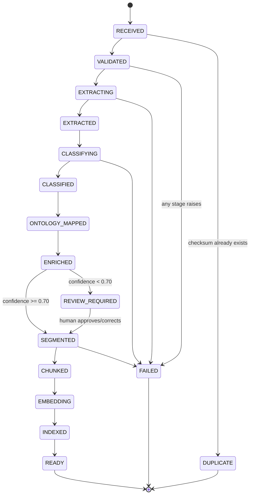

# Ingestion Architecture

## The state machine

Every document moves through the same sequence of states, defined in `app/core/enums.py` (`IngestionStatus`) and driven end-to-end by `PipelineOrchestrator` (`app/pipeline/orchestrator.py`):

`REVIEW_REQUIRED`, `FAILED`, and `DUPLICATE` are terminal-or-suspended states (`IngestionStatus.terminal_states()`) — a document doesn't silently keep moving forward from any of them without an explicit action (a human review decision, or a retry call).

Two things are worth noting about where the review branch sits: it happens *after* `ENRICHED`, not immediately after classification. Ontology mapping and entity/topic enrichment both run before the confidence check, because that metadata is useful to a human reviewer deciding what the document actually is, even for a document that's about to be flagged as uncertain.

## Why checksum dedup at receive time, not fine-grained checkpointing

Two different idempotency concerns show up in this pipeline, and they're solved differently on purpose:

**1. "Is this the same file I've already ingested?"** — solved once, cheaply, at the very start. `ingest_document()` computes a SHA-256 checksum of the raw bytes before any parsing happens and looks it up against `Document.checksum` (indexed, unique). A match short-circuits immediately into a `DUPLICATE` record pointing at the original (`duplicate_of_id`) — no extraction, no classification, no wasted work. This is the check that actually matters at scale: re-uploading the same file (or the same file arriving from two source systems) should never double-process it.

**2. "What happens if a stage fails partway, or a human correction needs the pipeline to re-run?"** — solved by clearing and recreating, not by fine-grained per-stage checkpointing. `_clear_derived_rows()` deletes a document's existing `Chunk`/`Embedding`/`DocumentSegment` rows before segmentation runs again, whether that's a first run, a retry after `FAILED`, or a resume after a review correction. The alternative — tracking exactly which chunks/embeddings survived a partial failure and only recomputing the delta — would be more efficient, but meaningfully more complex to get right, for a pipeline where segmentation-through-indexing for one document takes a fraction of a second. This is a **deliberate simplicity-over-efficiency POC trade-off**: re-deriving from `EXTRACTED` forward is cheap enough here that correctness-by-construction (there is no derived data left over from a previous, possibly-different classification) is worth more than the recomputation cost it avoids. A production system processing much larger documents at much higher volume would likely want per-stage checkpointing instead — see [production-scaling.md](production-scaling.md).

Two entry points exercise the "re-run" path:

- `retry_document()` — for a document in `FAILED`, re-reads the stored file from `storage_path` and reruns the full pipeline from `VALIDATED` forward.
- `resume_after_review()` — for a document just resolved out of `REVIEW_REQUIRED` (approved or corrected), re-extracts the stored file, clears derived rows, and continues from `SEGMENTED` onward using the now-resolved classification. It does not re-run detection or classification — a human already made that decision.

## Event-driven design: in-process now, Kafka-shaped later

Every stage transition is recorded twice, in two different ways that serve two different purposes:

- **`ProcessingEvent`** rows (`app/models/processing_event.py`) are the durable, queryable audit trail — `event_type`, `stage`, `status`, `message`, `duration_ms`, timestamped, one row per transition, append-only. This is what `GET /api/ingestion/jobs/{id}` renders as a document's processing history.
- **`EventBus.publish()`** (`app/events/bus.py`) fires the same event type and a payload (`document_id`, `stage`, `message`) to any in-process subscriber, synchronously, in the same call stack that persisted the `ProcessingEvent` row.

The module docstring is explicit about the intent: *"Stands in for Kafka/Event Hub/PubSub in the POC: same event names, same payload shapes, dispatched synchronously in-process instead of through a broker. A production deployment would replace `publish()`'s body with a topic produce call and let independent consumer groups (extraction workers, classification workers, embedding workers, ...) scale independently. Nothing upstream of this module would need to change."*

Concretely, `event_type` values already match what a Kafka topic name would look like (`DocumentUploaded`, `ExtractionCompleted`, `ClassificationCompleted`, `OntologyMapped`, `EnrichmentCompleted`, `SegmentationCompleted`, `ChunkingCompleted`, `EmbeddingCompleted`, `IndexingCompleted`, `ReviewRequired`, `ReviewResolved`, `Failed`, `DuplicateDetected` — see `ProcessingEventType` in `app/core/enums.py`). The POC's `EventBus.publish()` calls subscriber functions directly; a production version would serialize the same payload onto a topic and let each pipeline stage become its own consumer group, scaling independently of the others (extraction is CPU-bound and format-dependent; embedding is batchable; classification's LLM-gated tail is latency-bound and rate-limited). See [decisions.md](decisions.md) ADR-006 and [production-scaling.md](production-scaling.md) for the full production shape.

## Failure handling

A stage that can't complete raises `PipelineStageError(stage, message)` (`app/pipeline/exceptions.py`), caught centrally in `ingest_document()`/`retry_document()`/`resume_after_review()` and turned into:

- `Document.status = FAILED`
- `Document.error_message = "[STAGE] message"` — human-readable, stage-tagged, surfaced directly in the API and the ingestion job detail view.
- A `Failed` `ProcessingEvent` with `status="FAILURE"`.

A bare (non-`PipelineStageError`) exception is also caught as a defensive catch-all and recorded the same way, tagged with whatever stage the document's `status` was last set to — the pipeline is designed to never leave a document silently stuck with no record of what happened. Specific validation failures are raised early and cheaply: an unsupported file type or a magic-byte mismatch (`FileDetector._integrity_check` — e.g. a `.pdf` extension on a file that doesn't start with `%PDF`) fails at `VALIDATED`, before any parser touches the bytes, with a clear message rather than a stack trace from deep inside a parsing library.

`POST /api/documents/{id}/retry` is the operator-facing recovery action — it only accepts documents currently in `FAILED`, and re-runs the pipeline idempotently per the "clear and recreate" approach above.

## Ingestion jobs

Every batch of documents processed together — a single upload or a full seed run — is grouped under an `IngestionJob` (`app/models/ingestion_job.py`), tracking `total_documents`/`completed_documents`/`review_documents`/`failed_documents`/`duplicate_documents` and a running `avg_processing_seconds`. `GET /api/ingestion/jobs` and `GET /api/ingestion/jobs/{id}` (the latter including the last 50 `ProcessingEvent`s across the job's documents) back the observability view a manager would actually want when asking "how did the last batch go."

## Versioning: why every derived row carries a version stamp

`Document`, `Chunk`, and `ClassificationResult` all carry `extractor_version`, `classifier_version`, `chunker_version`, and `ontology_version` (from `Settings`, currently `1.0`/`1.2`/`1.1`/`1.0` respectively). This is not decorative. Because the pipeline re-derives segments/chunks/embeddings on any retry or resume (see above), a component upgrade — a new heading heuristic in the PDF extractor, a recalibrated classifier constant, a new chunker — changes what a *newly processed* document looks like without silently rewriting the meaning of *already-processed* documents' historical records. `ClassificationResult` additionally keeps every past classification attempt with an `is_current` flag rather than overwriting in place, specifically so a later re-classification (whether triggered by a version bump or a human correction) never erases what the system used to believe.
