# The Controlled Ontology

## Why a controlled ontology at all

A "controlled" ontology means a classifier is only ever allowed to resolve a document to one of a fixed, pre-defined set of leaf categories — never an arbitrary label it invents on the fly. This matters for reasons that have nothing to do with classification accuracy:

- **Security policy can be attached to a category, not to a document.** Every document that lands in `financial.*` inherits the same default security level and allowed groups. Without a controlled vocabulary, security would have to be decided per-document from scratch, or worse, per ad hoc keyword rule scattered through application code.
- **Reporting and filtering stay meaningful over time.** "Show me all Legal contracts" only means something consistent if "Legal contract" is a fixed thing, not whatever string a classifier happened to emit that day.
- **A human reviewer has a finite, learnable set of choices.** Correcting a misclassification means picking from a known list of valid categories, not inventing a new one under review-queue time pressure.
- **It's auditable.** Every category in the system is visible in one file. Nothing is a magic string buried in a conditional somewhere in `app/`.

## Why YAML config, not hardcoded Python

`ontology/healthcare_ontology.yaml` is the single source of truth for every category a document can be classified into — see `app/ontology/service.py`'s module docstring: *"Every other module (classifiers, chunker selector, security defaults, API routes) goes through this service, so the ontology can be edited/versioned in `ontology/healthcare_ontology.yaml` without touching application code."*

Concretely, that means:

- A domain expert (or a manager reviewing this POC) can read the entire controlled vocabulary in one YAML file without reading Python.
- Adding a new document type — say, `clinical.medical_research.systematic_review` — is a YAML edit plus a version bump, not a code change, a redeploy, or a schema migration.
- The ontology is versioned independently of the code that reads it (`ontology_version: "1.0"` at the top of the file, persisted onto every `Document`/`Chunk`/`ClassificationResult` row via `ontology_version`). A future re-categorization doesn't silently reinterpret history — every row still says which ontology version classified it.
- `OntologyService` materializes the YAML into the `ontology_nodes` table at startup (`app/core/startup.py: sync_ontology_nodes`) purely so the API/UI can query it relationally; the YAML file remains the actual source of truth, re-synced on every boot.

This is ADR-001 in [decisions.md](decisions.md) — the trade-off there is specifically "controlled taxonomy vs. knowledge graph," not "config file vs. hardcoded," but the same YAML-as-source-of-truth argument underlies both.

## The tree

Root: **Healthcare**. Five domains, each with its own categories and leaf document types. Every leaf's `keywords` list feeds the rule-based classifier (see [classification.md](classification.md)); every category's `chunker` value is the *semantic* chunking hint used only when file structure itself doesn't already force a chunker (see [chunking.md](chunking.md)).

```mermaid
flowchart TD
    ROOT[Healthcare] --> CLIN[Clinical<br/>restricted · clinical, executive]
    ROOT --> ADMIN[Administrative<br/>internal · employee, executive]
    ROOT --> FIN[Financial<br/>confidential · finance, executive, provider-management]
    ROOT --> LEGAL[Legal<br/>confidential · legal, provider-management, executive]
    ROOT --> TECH[Technical<br/>internal · engineering, executive]

    CLIN --> CLIN1[Patient Records<br/>chunker: generic]
    CLIN --> CLIN2[Clinical Guidelines<br/>chunker: technical]
    CLIN --> CLIN3[Procedures<br/>chunker: technical]
    CLIN --> CLIN4[Medical Research<br/>chunker: generic]

    ADMIN --> AD1[Policies<br/>chunker: technical]
    ADMIN --> AD2[Procedures<br/>chunker: technical]
    ADMIN --> AD3[Forms<br/>chunker: generic]
    ADMIN --> AD4[Communications<br/>chunker: email]

    FIN --> F1[Claims<br/>chunker: spreadsheet]
    FIN --> F2[Invoices<br/>chunker: generic]
    FIN --> F3[Payments<br/>chunker: spreadsheet]
    FIN --> F4[Reimbursement<br/>chunker: technical]

    LEGAL --> L1[Contracts<br/>chunker: contract]
    LEGAL --> L2[Agreements<br/>chunker: contract]
    LEGAL --> L3[Compliance<br/>chunker: technical]
    LEGAL --> L4[Regulations<br/>chunker: technical]

    TECH --> T1[Architecture<br/>chunker: technical]
    TECH --> T2[API Documentation<br/>chunker: technical]
    TECH --> T3[Runbooks<br/>chunker: technical]
    TECH --> T4[Troubleshooting<br/>chunker: technical]
```



Each category above has one or more leaf document types beneath it (18 leaves total, one per demo corpus document type — e.g. `financial.claims` has both `insurance_claim_report` and `claims_data_export`). The full leaf list, with `document_type`, `document_subtype`, and keywords, is in `ontology/healthcare_ontology.yaml` — reproduced here at the category level to keep this page readable.

| Domain | Default security level | Default allowed groups | Categories |
|---|---|---|---|
| **Clinical** | `restricted` | clinical, executive | Patient Records, Clinical Guidelines, Procedures, Medical Research |
| **Administrative** | `internal` | employee, executive | Policies, Procedures, Forms, Communications |
| **Financial** | `confidential` | finance, executive, provider-management | Claims, Invoices, Payments, Reimbursement |
| **Legal** | `confidential` | legal, provider-management, executive | Contracts, Agreements, Compliance, Regulations |
| **Technical** | `internal` | engineering, executive | Architecture, API Documentation, Runbooks, Troubleshooting |

Security defaults cascade **domain → category → leaf** (a leaf inherits its category's, which inherits its domain's) unless overridden lower down — in the current ontology file, no category or leaf overrides its domain default, so security policy is effectively a per-domain decision today. This is a deliberate design point, not an accident: **security policy lives in ontology config, not scattered in code** (see [security.md](security.md)).

## What `OntologyNode` actually carries

From `app/ontology/service.py`:

```python
@dataclass
class OntologyNode:
    id: str                              # e.g. "legal.contracts.provider_agreement"
    name: str
    level: str                           # "domain" | "category" | "type"
    path: list[str]                      # ["Healthcare", "Legal", "Contracts", "Provider Agreement"]
    parent_id: str | None
    keywords: list[str]                  # leaf-only; feeds RuleBasedClassifier
    chunker: str | None                  # semantic chunking hint (category/leaf)
    document_type: str | None            # coarse UI-facing label (leaf-only)
    default_security_level: str | None
    default_allowed_groups: list[str]
```

`document_type` is intentionally *more specific* than the category name — two leaves under the same "Architecture" category can be genuinely different document types (`architecture_document` for a written doc vs. `presentation` for a slide deck), because they're consumed differently downstream even though they sit in the same part of the tree.

## Controlled classification enforcement

`OntologyService.resolve_or_none()` is the enforcement point: *"a classifier may only resolve to a type id that exists in this ontology. Anything else must be treated as unknown by the caller."* `HybridClassifier` calls this before returning a result — if the winning id somehow isn't a real leaf (shouldn't happen given the candidate-generation logic, but the check exists anyway), the document is routed to `unclassifiable` rather than tagged with a made-up category. The LLM adjudication stage goes further: it is never given free text to classify into, only the closed candidate list of real ontology ids already narrowed down by the rule+embedding stage (`LLMClassifier.classify_among`), and any LLM response naming an id outside that list is discarded outright (`app/classifiers/llm_based.py`). Controlled classification is enforced structurally, not by convention.

## Querying the ontology at runtime

`GET /api/ontology` returns the full tree with live document/chunk counts rolled up per node (`app/api/ontology.py`); `GET /api/ontology/{node_id}` returns per-node stats — document count, chunk count, top entities, top topics, recent documents — computed by matching `ontology_id` and its dotted-prefix children (`legal.contracts` also rolls up `legal.contracts.provider_agreement`). This is read-only aggregation over already-classified data; the ontology tree itself is only ever loaded from the YAML file, never mutated by these endpoints.
